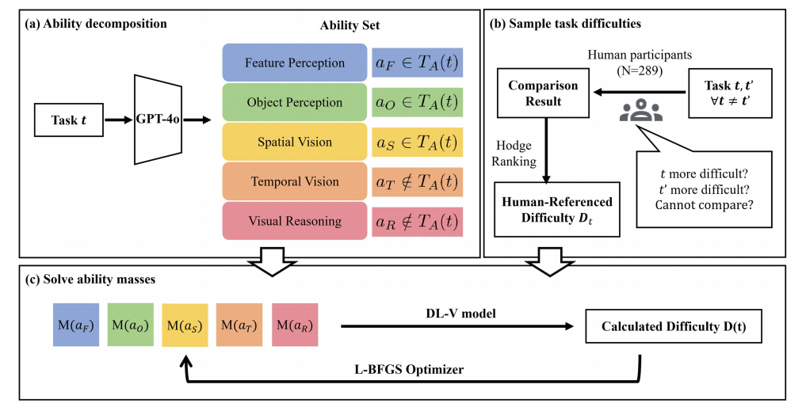
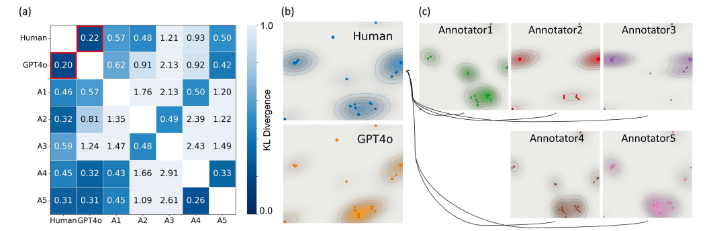
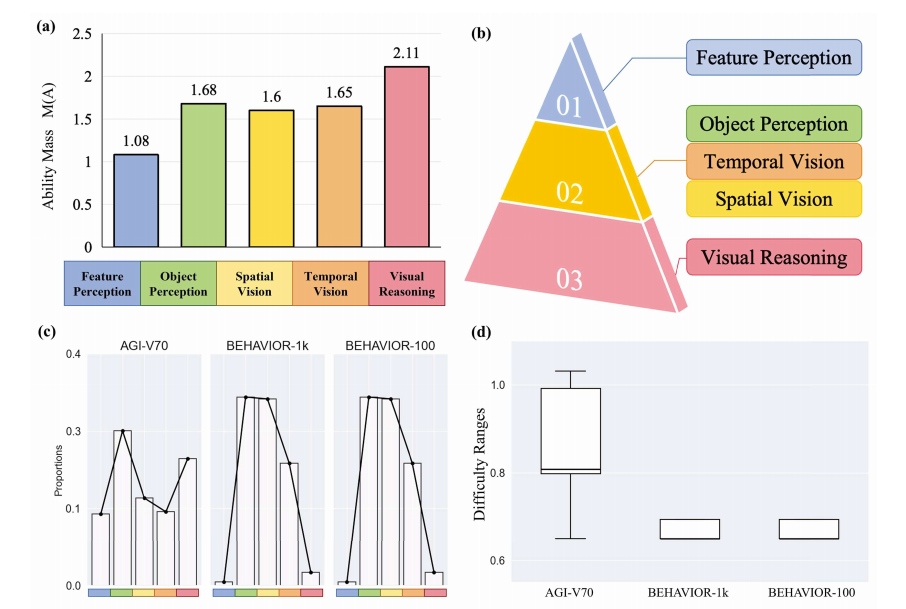

# Part 2. An anonymous example of interpretable task decomposition and difficulty analysis

This part provides an anonymized example of a method for decomposing visual tasks into underlying ability components and estimating their difficulty levels.

Its role here is limited but useful.  
It is **not** meant to directly test whether a black-box system contains a particular internal module or architectural mechanism.  
Instead, it supports a narrower point: evaluation can be made more interpretable by clarifying **what a task requires** and **how difficult the task is**.

In other words, this part focuses on the **task side** of evaluation rather than the **system side**.

### Core idea

Many realistic tasks are composite rather than atomic.  
For example, a visually grounded task may require object recognition, spatial understanding, temporal interpretation, and reasoning over visual context.

Instead of treating such a task as a single opaque benchmark item, this method maps each task to a set of required abilities and then estimates task difficulty from that composition.

### Method overview

The pipeline has three stages:

1. **Ability decomposition**  
   Each task is mapped to a predefined ability set.

2. **Human-referenced difficulty estimation**  
   Human pairwise comparisons are used to determine which tasks are perceived as more difficult.

3. **Difficulty modeling**  
   Task difficulty is estimated from ability composition and aligned with the human-referenced ordering.

### Why this part is included

This part is included to support a simple methodological point:

- a benchmark score alone does not tell us much about what a task is actually testing;
- task decomposition helps clarify which abilities are involved;
- difficulty analysis helps clarify how demanding a task is relative to others.

So this section should be read as an example of **interpretable evaluation design**, not as a direct test of internal architecture.

### Illustrative figures

A simple way to read this part is:
it asks two questions — **what abilities does a task require, and how difficult is that task relative to others?**

#### 1. Pipeline overview

**Figure 1.** Overview of the anonymous task decomposition and difficulty analysis pipeline.

From left to right:

- the task is decomposed into required abilities,
- human participants compare task pairs by difficulty,
- and the method estimates task difficulty so that the predicted ordering matches human judgments as closely as possible.

The key point is that task difficulty is grounded in both **ability composition** and **human comparison data**.

#### 2. Comparison between automated and human ability annotation

**Figure 2.** Comparison between automated ability annotation and human judgments.

This figure asks whether automatic task–ability labeling is broadly consistent with human judgment.

- **(a)** shows that the automated annotation is relatively close to the aggregated human result, while individual human annotators also differ from one another.
- **(b)** shows that the overall pattern of automated annotations is similar to the pattern of aggregated human annotations.
- **(c)** shows that human annotators themselves are variable, so exact agreement should not be expected.

The main takeaway is that the automated annotation is not arbitrary: it broadly follows the same task–ability structure captured by human judgment, while being more scalable for large-scale evaluation.

#### 3. Explainable outputs and benchmark analysis

**Figure 3.** Example outputs of the anonymous framework after task decomposition and difficulty analysis.

This figure shows what the framework can provide beyond a single task score:

- **(a)** shows which ability dimensions are assigned greater weight in the final difficulty estimation.
- **(b)** shows that these abilities can still be organized in an intuitive and interpretable way.
- **(c)** compares which abilities are covered by different benchmark sets.
- **(d)** compares how wide the difficulty range is in different benchmark sets.

The main takeaway is that the framework does not only say whether a system performs well or poorly.  
It also helps explain what kinds of abilities are being tested and how challenging the benchmark is overall.

### Suggested source mapping for the figures

If you are exporting figures from the anonymous paper, the following mapping is recommended:

- `figures/fig_part2_pipeline.png`  
  → original Figure 2

- `figures/fig_part2_human_model_agreement.png`  
  → original Figure 3

- `figures/fig_part2_explainable_results.png`  
  → original Figure 6

### Takeaway

This part is included as an anonymized example of:

- interpretable task decomposition,
- structured difficulty analysis,
- and clearer analysis of what a benchmark is actually testing.

It should not be read as direct evidence that a particular internal architectural component exists in a black-box system.

---
