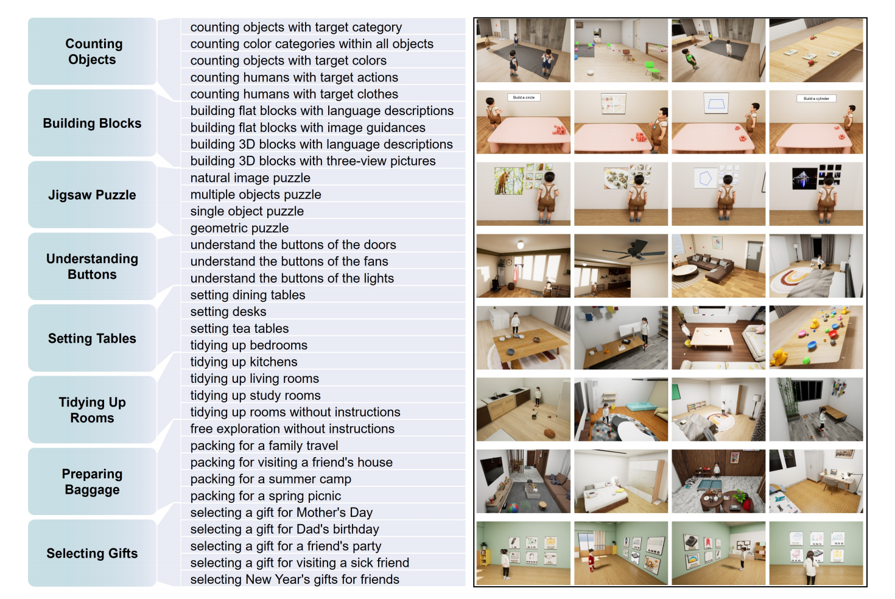
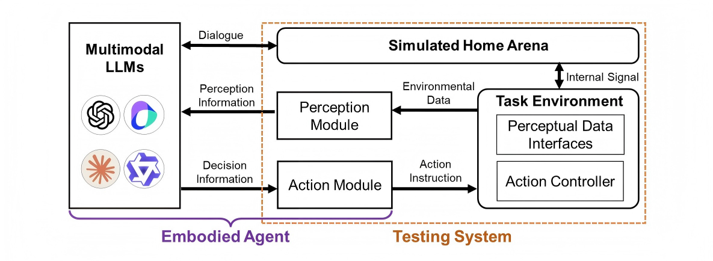
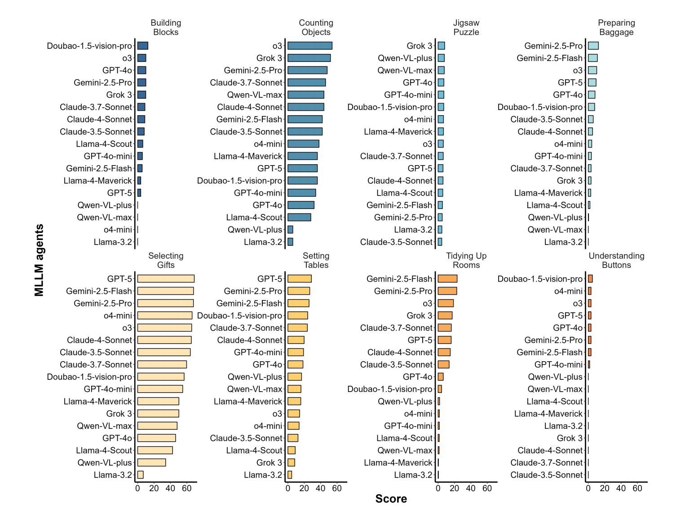
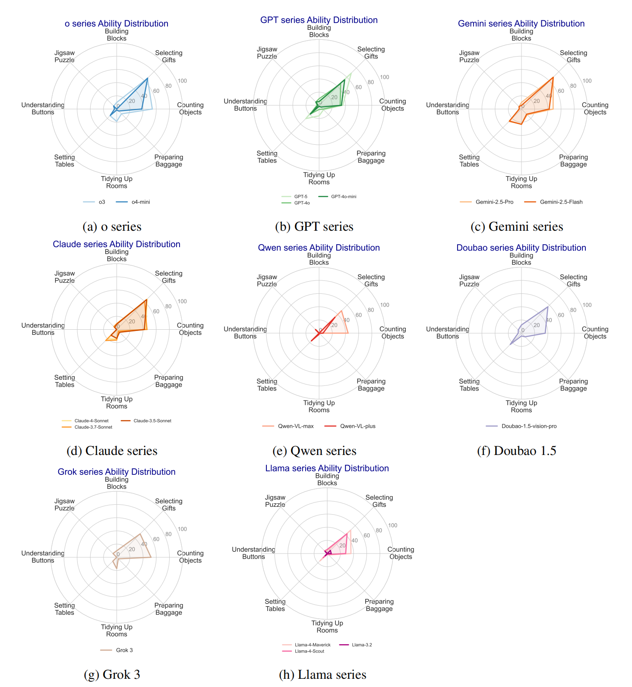

# Part 3. Results on the original eight household tasks

This part contains the original fixed eight-task household evaluation results, which serve as a worked embodied benchmark example.

### Benchmark scope

We construct eight daily embodied task categories in simulated home environments:

- Counting Objects  
- Building Blocks  
- Jigsaw Puzzle  
- Understanding Buttons  
- Setting Tables  
- Tidying Up Rooms  
- Preparing Baggage  
- Selecting Gifts  

These categories cover a range of embodied capabilities, including object understanding, spatial reasoning, and activity completion.

**Figure 4.** Overview of the eight household task categories and representative subtasks.

### Evaluation framework

The evaluation is conducted in a simulated home arena through a perception–decision–action loop.  
The system connects multimodal LLMs with the embodied environment through a perception module and an action module.

**Figure 5.** System framework for evaluating MLLM-based embodied agents.

### Task-level performance

The following figure shows model performance across the eight task categories.

**Figure 6.** Performance of evaluated MLLM agents across the eight task categories.

### Model family comparison

The following figure summarizes the performance profiles of major model families across task categories.

**Figure 7.** Performance profiles of major model families across the benchmark.

### Interpretation

This part functions as an embodied worked example of structured task-family evaluation.  
It shows that application-oriented and autonomy-relevant evaluation can be implemented in a simulated yet realistic environment.

---
