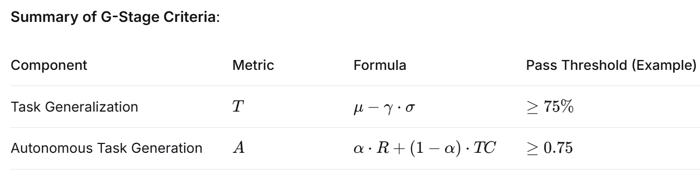

# Part 1. A concrete example of GSA-style evaluation

This part presents a more detailed worked example of how a GSA-style evaluation pipeline can be instantiated in an embodied setting.

Importantly, this example is intended to show **one possible operationalization** of the GSA framework, rather than the only valid pathway for evaluation.  
Its purpose is not to prescribe a universal benchmark or a fixed testing recipe, but to make the stage logic more explicit and easier to inspect in practical experimental terms.

In this example, the key idea is that **G, S, and A are distinguished by the type of evidence required**, not simply by task difficulty.  
A harder benchmark does not automatically imply a higher stage.  
Instead, each stage asks a different question about the system:

- **G (General)** asks whether the system shows foundational capacities such as cross-family generalization and the ability to generate or adapt tasks beyond a fixed benchmark list.
- **S (Specialized)** asks whether those capacities can be consolidated into stable, high-level competence within a structured domain.
- **A (Applicable)** asks whether the system can sustain reliable, safe, and value-consistent performance under realistic deployment conditions.

For implementation details, generated-task examples, and quantitative statistics, see:

- [task_generation_results.md](task_generation_results.md)

### Why stage boundaries should be defined by evidence profiles

A central motivation of the GSA framework is that strong performance on a fixed task suite does not by itself tell us what kind of capability has been demonstrated.

For example:

- a system may perform well on a structured benchmark through narrow specialization, without showing robust generalization beyond that benchmark;
- a system may solve many specialized tasks in a controlled setting, yet still fail when deployed in an open environment with disturbances, safety constraints, and long-horizon interaction;
- a system may execute assigned tasks well, but still lack the ability to autonomously generate relevant goals or useful task variations.

For this reason, the three stages are defined here as **different evidence profiles** rather than as a single continuous score.

### An illustrative GSA-style testing logic

### G stage: General evidence

The goal of the G stage is to test whether the system demonstrates broad and robust generalization across structurally diverse task families, rather than only competence on a fixed benchmark list.

In this worked example, **task families** are defined as sets of tasks that share an underlying structure while differing in objects, layouts, contexts, or environmental conditions.  
The key question is not whether the system memorizes a particular task template, but whether it can transfer its competence across variations that preserve task structure while changing surface form.

#### What is evaluated

The G stage focuses on two kinds of evidence:

1. **Task generalization capability**
   - Can the system maintain competent performance across both seen and unseen tasks?
   - Does its performance remain robust under task-family variation and environmental variation?
   - Can it handle new instances without additional training or fine-tuning?

2. **Autonomous task generation capability**
   - Can the system generate tasks on its own rather than only execute externally assigned ones?
   - Are the generated tasks relevant to actual household needs?
   - Do the generated tasks cover a sufficiently broad range of household task categories?

#### Operationalization

- **Task families**: groups of tasks with shared task structure.
- **Evaluation protocol**: test the system on both **seen** and **unseen** tasks under the same conditions, without additional training or fine-tuning.

#### Passing logic

A system is treated as reaching the G stage only when all of the following are supported by evidence:

- **Task Generalization Capability (T)**: performance remains consistent across seen and unseen tasks.
- **Autonomous Task Generation Capability (A)**:
  - **Relevance (R)**: generated tasks align with actual household needs.
  - **Task Coverage (TC)**: generated tasks cover a diverse set of household task categories.

**Table 1. Summary of one illustrative G-stage decision rule.**  
This figure shows one possible way to operationalize the **G stage** through two components: **Task Generalization (T)** and **Autonomous Task Generation (A)**.

For task generalization, **T = μ − γ · σ**, where **μ** is the mean accuracy across task categories, **σ** is the standard deviation of those accuracies, and **γ** controls how strongly unstable cross-category performance is penalized. In simple terms, **T** rewards systems that are both accurate on average and consistent across categories.

For autonomous task generation, **A = α · R + (1 − α) · TC**, where **R** measures how relevant the generated tasks are to real household needs, **TC** measures how broadly they cover different household task categories, and **α** controls the balance between these two terms.

The thresholds shown in the figure, such as **T ≥ 75%** and **A ≥ 0.75**, are intended as example values only. Their purpose is to show how a G-stage decision rule can be made explicit in practice: a system should not reach **G** merely by performing well on a few tasks, but by demonstrating both **stable generalization** and **meaningful autonomous task generation**.```
In simple terms, the G stage is meant to show that the system can both **generalize beyond previously encountered task instances** and **produce meaningful and sufficiently diverse tasks of its own**.  
This is why G is not defined as “doing well on many tasks,” but as showing evidence of foundational cross-task transfer and autonomy.

### S stage: Specialized evidence

The goal of the S stage is to test whether the system, after satisfying the G-stage prerequisites, can achieve stable and strong competence within a defined structured domain.

Here the emphasis is no longer on breadth across diverse task families, but on **depth, stability, and repeatability** within a more clearly bounded task domain.  
Typical examples include a structured household task portfolio or a domain such as object search in a 3D environment.

#### What is evaluated

The S stage focuses on whether the system can:

- repeatedly solve a curated set of structured tasks with high success;
- maintain performance across repeated sessions rather than succeeding only once;
- exhibit stable competence under controlled conditions where the success criteria are clearly defined.

#### Operationalization

- **Task portfolio**: a curated set of specialized tasks with clear criteria such as success rate, completion time, and number of resets.
- **Evaluation environment**: controlled lab or testbed settings with consistent lighting, object placement, and task initialization.

#### Passing logic

A system is treated as reaching the S stage only when all of the following are supported by evidence:

- **Success Rate >= 90%** across the specialized task portfolio, averaged over at least **100 trials per task**.
- **Performance Degradation <= 5%** when tasks are repeated across multiple sessions.

In simple terms, the S stage is meant to show that the system’s general capacities can be consolidated into **stable, reusable, and high-performance domain competence**.  
This is why S is not merely “doing some hard tasks,” but demonstrating reliable specialization within a structured evaluation scope.

### A stage: Applicable evidence

The goal of the A stage is to test whether the system, after satisfying the G and S prerequisites, can operate reliably in realistic real-world environments over time.

The key distinction of the A stage is that the question is no longer whether the system can solve tasks in principle, but whether it can remain **robust, safe, recoverable, and useful under deployment conditions**.  
This includes environmental variability, long-horizon execution, partial failures, human interaction, and real costs of error.

#### What is evaluated

The A stage focuses on whether the system can:

- complete realistic tasks, including cases not covered during S-stage testing;
- operate with a high degree of autonomy;
- recover from partial failures without external rescue;
- avoid critical safety violations;
- maintain acceptable user experience and value-consistent behavior;
- sustain these properties over an extended deployment period.

#### Operationalization

- **Deployment setting**: real-world environments such as homes, warehouses, or hospitals, with natural variability in lighting, clutter, and human activity.
- **Evaluation duration**: extended continuous operation (for example, one month).
- **Human-in-the-loop assessment**: end users or supervisors provide ratings on usability, reliability, and safety.

#### Passing logic

A system is treated as reaching the A stage only when all of the following are supported by evidence:

- **Task Completion Rate >= 85%** across realistic use cases, including novel scenarios not seen during S-stage testing.
- **Autonomy Ratio >= 90%**, where autonomy ratio is the proportion of task attempts that succeed without human intervention.
- **Recovery Rate >= 70%**, where recovery rate is the proportion of partial failures from which the system autonomously recovers and continues execution.
- **Critical Safety Incidents <= 1%**, including failures such as causing injury or property damage.
- **User Experience Score >= 4.0 / 5.0** on post-deployment surveys covering safety, reliability, and value-consistent behavior.
- **Sustained Performance**: all of the above metrics must hold over at least **1 month**, with weekly performance not dropping below **80%** of the initial level.

In simple terms, the A stage is meant to show **deployment readiness**, not just stronger benchmark performance.  
This is why A is not defined as “more difficult tasks,” but as evidence that competence remains reliable, safe, and useful under realistic operating conditions.

### How to interpret the stage transition

This worked example implies the following decision logic:

- A system belongs to **G** if it shows foundational evidence of cross-family generalization and autonomous task generation.
- A system belongs to **S** if it first satisfies the G prerequisites and then demonstrates stable, high-performance competence in a structured task domain.
- A system belongs to **A** if it first satisfies the G and S prerequisites and then demonstrates sustained, safe, and robust deployment performance in realistic environments.

In this sense, the stages are **cumulative but non-interchangeable**.  
Strong S-stage evidence does not replace G-stage evidence, and strong benchmark performance alone does not establish A-stage applicability.

### Interpretation

This part should be read as a **worked example**, not as a universal standard.  
Its purpose is to show that the distinction between G, S, and A can be made explicit through different kinds of evidence rather than through a single aggregate benchmark score.

---
