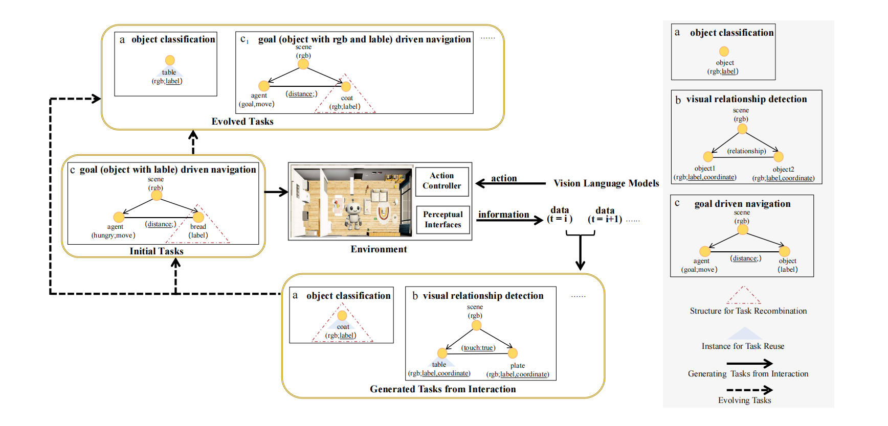
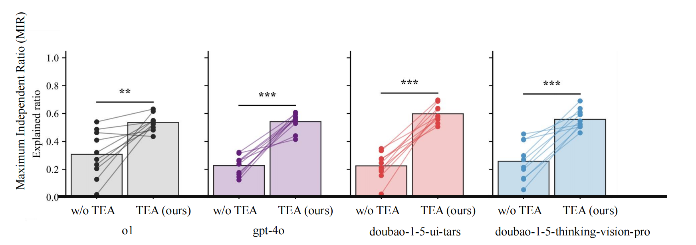

# Autonomous Task Generation: Quantitative Results

This document presents the quantitative results of our autonomous task generation framework, which supports the claims made in the rebuttal regarding **dynamic, in‑situ task generation**. All data are derived from experiments conducted in 10 distinct virtual indoor scenes.

---

## 1. Generated Task Statistics

| Metric | Value |
|--------|-------|
| Number of scenes | 10 |
| Generation cycles | 2 |
| Total generated tasks | **87,876** |
| Task types covered | perception (classification, localization, depth estimation), reasoning (mirror counting, embodied counting, pattern counting), spatial reasoning (relationship detection, object in‑view check), interaction (navigation) |

> The tasks were generated using a two‑stage interaction‑evolution pipeline (agent‑environment interaction + task graph evolution) without any initial task instances.

 
---

## 2. Task Diversity: Maximum Independent Ratio (MIR)

MIR measures the proportion of non‑redundant tasks in a set (higher values indicate greater diversity). The following table compares the diversity of tasks generated **without our method** (i.e., using only a VLM with no filtering or evolution) against tasks generated by our **full framework** after the first and second cycles.

| Method | Mean MIR (± std) | p‑value (vs. w/o method) |
|--------|------------------|--------------------------|
| Without our method | 0.307 ± 0.159 | – |
| Our method (first cycle) | **0.536 ± 0.055** | < 0.001 |
| Our method (second cycle) | **0.676 ± 0.156** | < 0.001 |

**Key finding:** Our framework significantly improves task diversity in all 10 scenes.

  
*Figure 2. MIR comparison across 10 scenes. Each point represents one scene; bars show the average MIR.*

---

## 3. Task Evolution: Integration Rate (MIR‑e)

MIR‑e measures the proportion of evolved tasks that are accepted into the existing task space (i.e., non‑redundant with previous tasks). Across all scenes and models, the average MIR‑e reached **0.75**, indicating that most evolved tasks contribute novel content.

| Model | MIR‑e |
|-------|-------|
| GPT-4o | 0.680 |
| GPT-o1 | 0.744 |
| Doubao-tars | 0.829 |
| Doubao-think | 0.731 |
| **Average** | **0.75** |

> These models were used for semantic task generation; the framework remains model‑agnostic.

---

## 4. Human Validation of Task Quality

A random 10% subset of generated tasks was evaluated by human participants to assess:

- **Validity:** 100% of tasks were judged as physically feasible and logically consistent (due to strict generation rules).
- **Relevance to daily life:** 90.8% of tasks were considered “providing meaningful assistance at home”.
- **Closeness to daily routines:** 84.9% of tasks were rated as “closely related to daily routines”.
- **Cognitive demand:** 94.4% of tasks were identified as “requiring essential cognitive faculties”.

These results confirm that the generated tasks are both realistic and cognitively meaningful.

---

## 5. Spatial Statistics of Generated Tasks

We analyze the spatial distribution of task instances to evaluate coverage and focus. The table below shows an example scene (one of the 10).

| Metric | τ (random exploration) | τ′ (targeted execution) |
|--------|------------------------|-------------------------|
| Enclosing volume (m³) | 744.84 | 744.84 |
| Δx / σx (m) | 9.37 / 1.84 | 9.37 / 2.00 |
| Δy / σy (m) | 20.90 / 1.94 | 20.90 / 1.94 |
| Δz / σz (m) | 3.80 / 0.92 | 3.80 / 1.01 |
| Mean instance volume ± std (m³) | 18.51 ± 58.26 | 43.60 ± 93.30 |
| Distinct objects involved | 38 | 19 |

**Observation:** Tasks generated during random exploration (τ) cover a broader spatial range, while those generated during targeted execution (τ′) concentrate in key functional areas, reflecting a desirable balance between exploration and semantic focus.

---

## 6. Relation to the Household Benchmark

The eight household tasks presented in the main supplementary page are **one concrete instantiation** of this generation paradigm. They demonstrate how the autonomously generated tasks can be organized into a structured evaluation suite for embodied agents.

For a description of the generation paradigm itself, see [task_generation_paradigm.md](task_generation_paradigm.md).

---

## 7. Summary

- **87,876 tasks** automatically generated in 10 scenes over 2 cycles.
- Task diversity improved significantly (MIR from 0.307 to 0.536, p < 0.001).
- Evolved tasks integrate well (MIR‑e = 0.75).
- Human validation confirms task realism and cognitive relevance.
- Spatial analysis shows tasks naturally shift from broad exploration to semantically meaningful regions.

These results provide empirical evidence that **autonomous, in‑situ task generation is feasible and produces diverse, realistic, and cognitively meaningful tasks** – supporting the core claims of the GSA framework.